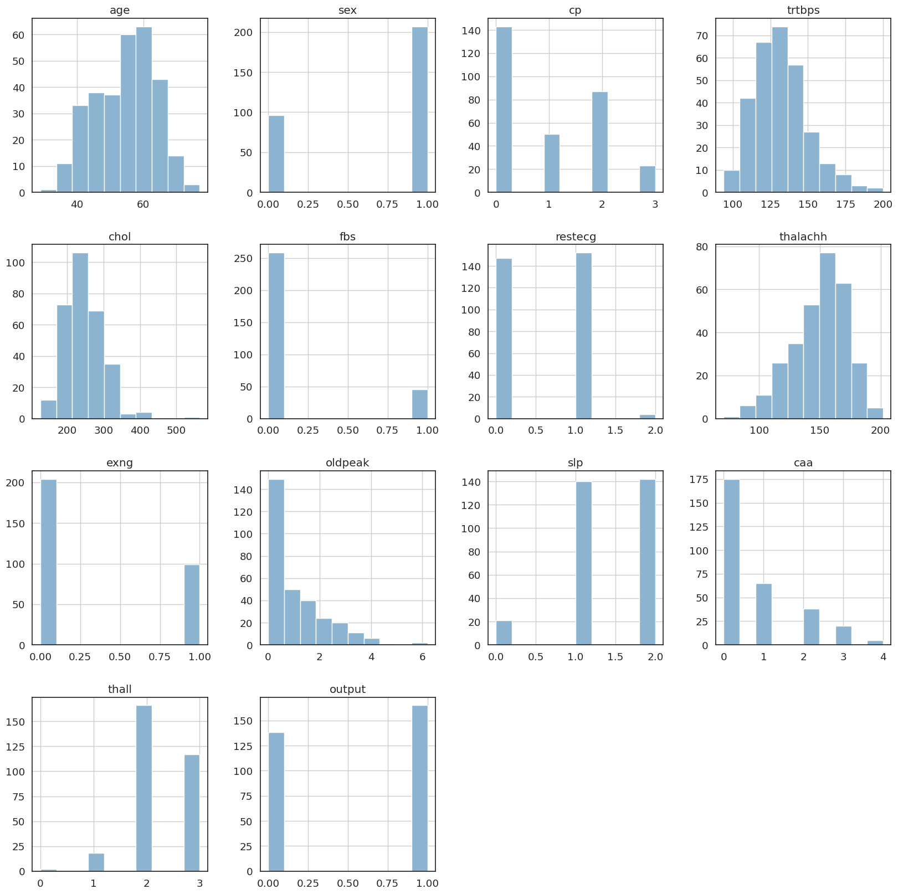
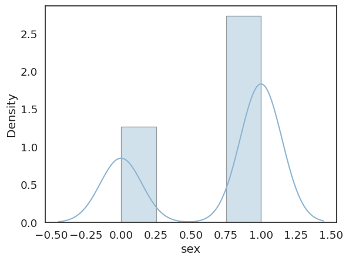
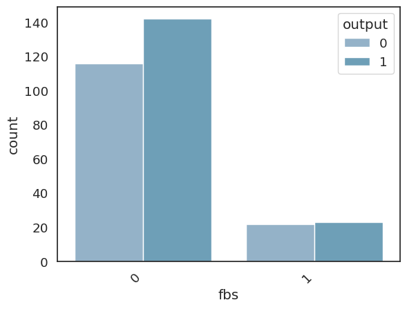
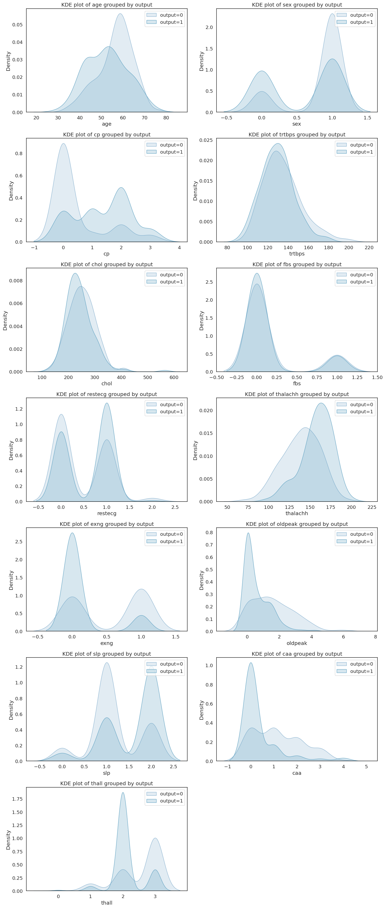

# Laporan Proyek Machine Learning
### Nama : Rina Juniar
### Nim : 211351126
### Kelas : Pagi B

## Domain Proyek

Dapat digunakan sebagai sebuah sistem aplikasi untuk memprediksi apakah seseorang terkena penyakit serangan jantung
## Business Understanding

Mengembangkan model prediksi serangan penyakit jantung untuk membantu identifikasi risiko potensial pada pasien, memungkinkan intervensi dini dan perawatan yang tepat waktu.

Bagian laporan ini mencakup:

### Problem Statements

- Keterbatasan Sistem Prediksi Heart Attack yang Ada:
Saat ini, terdapat keterbatasan dalam sistem prediksi serangan jantung yang tersedia. Beberapa model prediksi belum sepenuhnya akurat dan sensitif, menyebabkan tingkat kepercayaan yang rendah pada hasil prediksi tersebut.

-Kurangnya Integrasi Data yang Komprehensif:
Kurangnya integrasi data yang komprehensif menjadi hambatan dalam mengembangkan sistem prediksi serangan jantung yang efektif. Informasi medis dari berbagai sumber seringkali tidak terpadu dengan baik, mengakibatkan kurangnya kelengkapan data.

- Ketidakmampuan Mengidentifikasi Faktor Risiko yang Spesifik:
Beberapa sistem prediksi saat ini mungkin belum mampu mengidentifikasi faktor risiko yang spesifik dengan akurat. Hal ini dapat mengakibatkan penyelewengan dalam penilaian risiko individu, mengurangi efektivitas prediksi serangan jantung.

- Keterbatasan Teknologi yang Digunakan:
Adanya keterbatasan dalam teknologi yang digunakan untuk pengembangan sistem prediksi serangan jantung dapat membatasi kemampuan sistem untuk melakukan analisis mendalam dan akurat terhadap data medis kompleks.

- Kesulitan dalam Penyesuaian Model pada Populasi Beragam:
Setiap individu memiliki karakteristik kesehatan yang unik, dan pengembangan model prediksi serangan jantung yang dapat menyesuaikan diri dengan populasi yang beragam menjadi tantangan. Kesulitan ini dapat memengaruhi tingkat akurasi model di berbagai kelompok populasi.

- Kurangnya Edukasi dan Kesadaran Masyarakat:
Kurangnya edukasi dan kesadaran masyarakat mengenai pentingnya prediksi dini serangan jantung dapat menghambat penerimaan dan adopsi sistem prediksi. Masyarakat perlu didorong untuk lebih memahami manfaatnya dan mengakses sistem prediksi dengan lebih aktif.

- Tantangan dalam Pengumpulan Data Real-Time:
Pengumpulan data medis secara real-time menjadi tantangan dalam membangun sistem prediksi yang responsif. Keterlambatan dalam pengumpulan informasi dapat mengurangi kemampuan sistem untuk memberikan peringatan dini dengan tepat waktu.

- Ketidakpastian Terkait Faktor-faktor Lingkungan:
Faktor-faktor lingkungan seperti pola makan, aktivitas fisik, dan stres dapat mempengaruhi risiko serangan jantung. Pengidentifikasian dan penanganan faktor-faktor lingkungan ini dalam sistem prediksi serangan jantung masih menjadi tantangan tersendiri.

### Goals

- mencari solusi untuk memudahkan pasien atau seseorang mengetahui dirinya kemungkinan terkena penyakit serangan jantung atau tidak

    ### Solution statements
    - pengebangan platform sistem informasi tentang prediksi penyakit serangan jantung
    - Model yang dihasilkan dari datasets itu menggunakan metode KNN.

## Data Understanding
Dataset yang saya gunakan berasal jadi Kaggle yang berisi data prediksi diabetes.Dataset ini mengandung 304 baris dan 14 columns.

https://www.kaggle.com/datasets/rashikrahmanpritom/heart-attack-analysis-prediction-dataset 

### Variabel-variabel sebagai berikut:
- Usia : Usia pasien

- Jenis Kelamin : Jenis kelamin pasien

- exang: angina akibat olahraga (1 = ya; 0 = tidak)

- ca: jumlah kapal besar (0-3)

- cp : Tipe nyeri dada Tipe nyeri dada

Nilai 1 : angina tipikal
Nilai 2: angina atipikal
Nilai 3: nyeri non-angina
Nilai 4: tanpa gejala
trtbps : tekanan darah istirahat (dalam mm Hg)

- chol : kolestoral dalam mg/dl diambil melalui sensor BMI

- fbs : (gula darah puasa >120 mg/dl) (1 = benar; 0 = salah)

- rest_ecg : hasil elektrokardiografi istirahat

Nilai 0: biasa
Nilai 1 : mengalami kelainan gelombang ST-T (inversi gelombang T dan/atau elevasi atau depresi ST > 0,05 mV)
Nilai 2: menunjukkan kemungkinan atau pasti hipertrofi ventrikel kiri menurut kriteria Estes
thalach : tercapai denyut jantung maksimal

- target : 0= lebih kecil kemungkinan terkena serangan jantung 1= lebih besar kemungkinan terkena serangan jantung

## Data Preparation

# import dataset
```python
from google.colab import files
files.upload()
```
```python
!mkdir -p ~/.kaggle
!cp kaggle.json ~/.kaggle/kaggle.json
!chmod 600 ~/.kaggle/kaggle.json
!ls ~/.kaggle
```
```python
!kaggle datasets download -d rashikrahmanpritom/heart-attack-analysis-prediction-dataset
```

# import libary yang digunakan
```python
import numpy as np
import matplotlib.pyplot as plt
import pandas as pd
import seaborn as sns
from sklearn.metrics import confusion_matrix
import pickle
from sklearn.model_selection import train_test_split
from sklearn.neighbors import KNeighborsClassifier
from matplotlib.colors import ListedColorma
```
# data discovery
```python
df = pd.read_csv('/content/heart-attack-analysis-prediction-dataset/heart.csv')
```
```python
df.head()
```
```python
df.describe()
```
```python
df.describe().T
```
```python
df.isnull()
```
```python
df.info()
```
# EDA
-kode tersebut akan menghasilkan histogram untuk setiap kolom numerik dalam DataFrame 'df' dengan ukuran gambar 20x20. Histogram adalah representasi grafis dari distribusi frekuensi data, yang membantu dalam memahami pola dan karakteristik data numerik.
```python
a = df.hist(figsize = (20,20))
```

```python
```
-kode tersebut digunakan untuk membuat visualisasi histogram distribusi data pada kolom 'sex' dengan menyesuaikan lebar garis dan warna batas histogram menggunakan Seaborn.
```python
sns.distplot(df['sex'], hist_kws = dict(linewidth = 1, edgecolor = 'k'))
```


-Dengan menggunakan countplot, Anda dapat dengan mudah melihat distribusi jumlah data untuk setiap nilai pada kolom 'fbs', serta membedakan antara nilai 'output' yang berbeda menggunakan warna.
```python
sns.countplot(data=df,x='fbs',hue='output')
plt.xticks(rotation=45,ha='right');
```


- untuk memvisualisasikan KDE plot untuk setiap kolom DataFrame, dibagi berdasarkan nilai 'output' (0 atau 1), sehingga memungkinkan analisis distribusi masing-masing fitur tergantung pada kelompok 'output'.
```python
num_columns = len(df.columns) - 1
num_rows = (num_columns + 1) // 2

plt.figure(figsize=(15, 5*num_rows))


for i, column in enumerate(df.columns.drop('output')):
    plt.subplot(num_rows, 2, i+1)
    sns.kdeplot(data=df[df['output'] == 0][column], label='output=0', fill=True)
    sns.kdeplot(data=df[df['output'] == 1][column], label='output=1', fill=True)
    plt.title(f'KDE plot of {column} grouped by output')
    plt.legend()

plt.tight_layout()
plt.show()
```



```python
corr = df.corr()

target_corr = corr['output'].drop('output')

sns.set(font_scale=1.2)
sns.set_style("white")
sns.set_palette("PuBuGn_d")
sns.heatmap(target_corr.to_frame(), cmap="coolwarm", annot=True, fmt='.2f')
plt.title('Correlation with Target Column')
plt.show()
```
```python
sns.heatmap(df.isnull())
```
```python
sns.catplot(x= "sex", y = "output", hue = "caa",kind = "violin", data = df);
```
```python

```
```python

```
```python

```
# preprocesssing
```python
df=df.drop(['age'],axis=1)
```
```python
df=df.drop(['trtbps'],axis=1)
```
```python
df=df.drop(['chol'],axis=1)
```
```python
df=df.drop(['thalachh'],axis=1)
```
```python
df=df.drop(['oldpeak'],axis=1)
```
```python
atribut = ['sex','cp','fbs','restecg','exng','slp','caa','thall']
x = df[atribut]
y = df['output']
```
```python
x_train, X_test, y_train, y_test = train_test_split(x,y,random_state=90)
y_test.shape
```
```python

```
# MODELING
```python
knn = KNeighborsClassifier(n_neighbors=6)
knn.fit(x_train, y_train)
y_pred1=knn.predict(X_test)

score = knn.score(X_test, y_test)
print('Akurasi Model KNN =',score

Akurasi Model KNN = 0.7763157894736842
```
```python
input_data = (0,	0,	1,	1,	1,	1,	2, 3)

input_data_as_numpy_array = np.array(input_data)

input_data_reshape = input_data_as_numpy_array.reshape(1,-1)

prediction = knn.predict(input_data_reshape)
print(prediction)

if (prediction):
    print("Pasien Terkena Penyakit Jantung.")
else:
    print("Pasien Tidak Terkena Penyakit Jantung.")
```
```python

```
```python

```
```python

```
```python

```
# visualisasi
```python
train_acc = {}
test_acc = {}
neighbors = np.arange(1, 26)

for neighbor in neighbors:
  knn =  KNeighborsClassifier(n_neighbors=neighbor)
  knn.fit(x_train, y_train)
  train_acc[neighbor] = knn.score(x_train, y_train)
```
```python
plt.figure(figsize=(12,8))
plt.title("KNN: Varying Number of Neighbors")
plt.plot(neighbors, train_acc.values(), label="Training Accuracy")
plt.plot(neighbors, train_acc.values(), label="Testing Accuracy")
plt.legend()
plt.xlabel("Number of Neighbors")
plt.ylabel("Accuracy")
plt.show()
```
```python
palette = ["#FF0000", "#0000FF"]

Diabetes_count = df['output'].value_counts()[1]
No_Diabetes_count = df['output'].value_counts()[0]
total_count = len(df)
diabetes_percentage = (Diabetes_count / total_count) * 100
no_diabetes_percentage = (No_Diabetes_count / total_count) * 100

pie_values = [no_diabetes_percentage, diabetes_percentage]

colors = ['lightblue', 'lightcoral']

fig, axes = plt.subplots(nrows=1, ncols=2, figsize=(20, 7))
# First subplot - Pie chart
plt.subplot(1, 2, 1)
plt.pie(pie_values, labels=['No Heart Attack', 'Heart Attack'],
        autopct='%1.2f%%',
        startangle=90,
        explode=(0.1, 0.1),
        colors=colors,  # Use the defined colors
        wedgeprops={'edgecolor': 'black', 'linewidth': 1, 'antialiased': True})
plt.title('No Heart Attack vs Heart Attack')

# Second subplot - Countplot
plt.subplot(1, 2, 2)
ax = sns.countplot(data=df,
                x='output',
                palette=colors,  # Use the defined colors
                edgecolor='black')
for i in ax.containers:
    ax.bar_label(i)
ax.set_xticks([0, 1])  # Set ticks manually to match the categories
ax.set_xticklabels(['No Heart Attack', 'Heart Attack'])

plt.title('No Heart Attack vs Heart Attack')
plt.show()
```
```python
y_pred = knn.predict(X_test)
confusion_matrix(y_test,y_pred)
```
```python
sns.heatmap((confusion_matrix(y_test,y_pred)), annot=True, cmap="YlGnBu" ,fmt='g')
plt.title('Confusion matrix', y=1.05)
plt.ylabel('Actual label')
plt.xlabel('Predicted label')
plt.show()
```
# save model
```python
df.to_csv('heart-data.csv')
```
```python
filename = 'heart.sav'
pickle.dump(knn,open(filename,'wb'))
```
## Evaluation

```python
X_train_prediction = model.predict(X_train)
training_data_accuracy = accuracy_score(X_train_prediction, Y_train)
```
```python
print('akurasi data training :', training_data_accuracy)
```
0.7850162866449512
```python
X_test_prediction = model.predict(X_test)
test_data_accuracy =accuracy_score(X_test_prediction, Y_test)
```
```python
print('akurasi data testing :', test_data_accuracy)
```
0.7532467532467533

akurasi adalah metrik evaluasi yang mengukur seberapa baik model membuat prediksi yang benar dari total prediksi yang dilakukan. dalam konteks klasifikasi, akurasi memberikan gambaran mengenai seberapa sering model memprediksi kelas yang benar, baik kelas itu positif maupun negatif.
## Deployment
https://prediksi-jantung-by-rinajuniar.streamlit.app/
